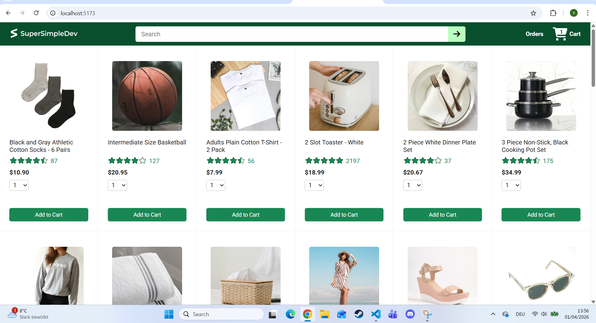
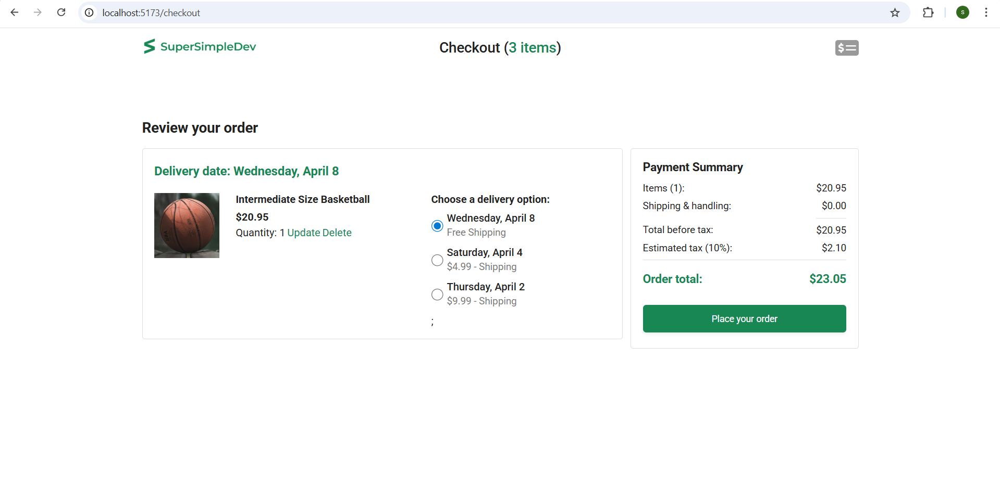
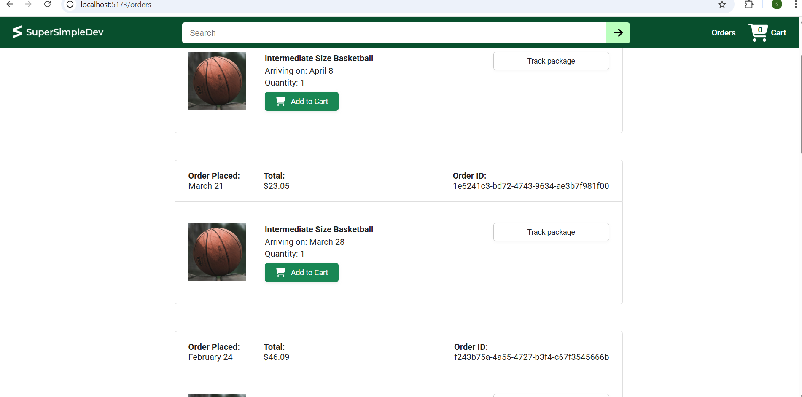
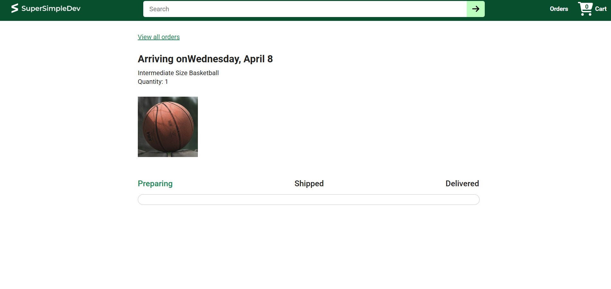

# 🛒 E-commerce Frontend Project

## 📌 About This Project

This project is a frontend implementation of an e-commerce website (Amazon-like), built as part of my learning journey in web development.

The base project was created by following a tutorial (SuperSimpleDev) to understand how real-world applications are structured and how frontend interacts with backend APIs.

After completing the tutorial, I focused on understanding the code and structure rather than just copying it.

---

## 📸 Screenshots

### Home Page


### Checkout


### Orders


### Tracking



## 🚀 Features

* Product listing page
* Add to cart functionality
* Checkout system
* Orders page
* Order tracking page
* Dynamic data from backend API

---

## 🛠️ Tech Stack

* React
* JavaScript / TypeScript
* Vite
* CSS

---

## 🧠 What I Learned

* Structuring a larger React application
* Working with multiple pages and components
* Connecting frontend with backend APIs
* Managing application state
* Debugging and understanding existing code
* Handling user interactions in a real project

---

## ⚠️ Note

This project is based on a tutorial.
My goal was to understand how a full application works and how frontend and backend communicate.

---

## ▶️ How to Run Locally

```bash
npm install
npm run dev
```

⚠️ Requires backend to be running locally.

---

## 🔗 Backend Repository
https://github.com/Selty-tech/ecommerce-backend

## 🎯 Current Goal

I am currently preparing for an Ausbildung as an **Anwendungsentwickler** in Germany.

My focus is on:

* improving my frontend skills
* understanding code deeply
* starting to build projects independently

---

## 👤 About Me

* Learning web development for ~1 year
* Experience with JavaScript, HTML, CSS, React
* Currently moving from tutorial-based learning to real projects

---

## 📬 Feedback

I am still learning, so any feedback is very welcome 🙂
